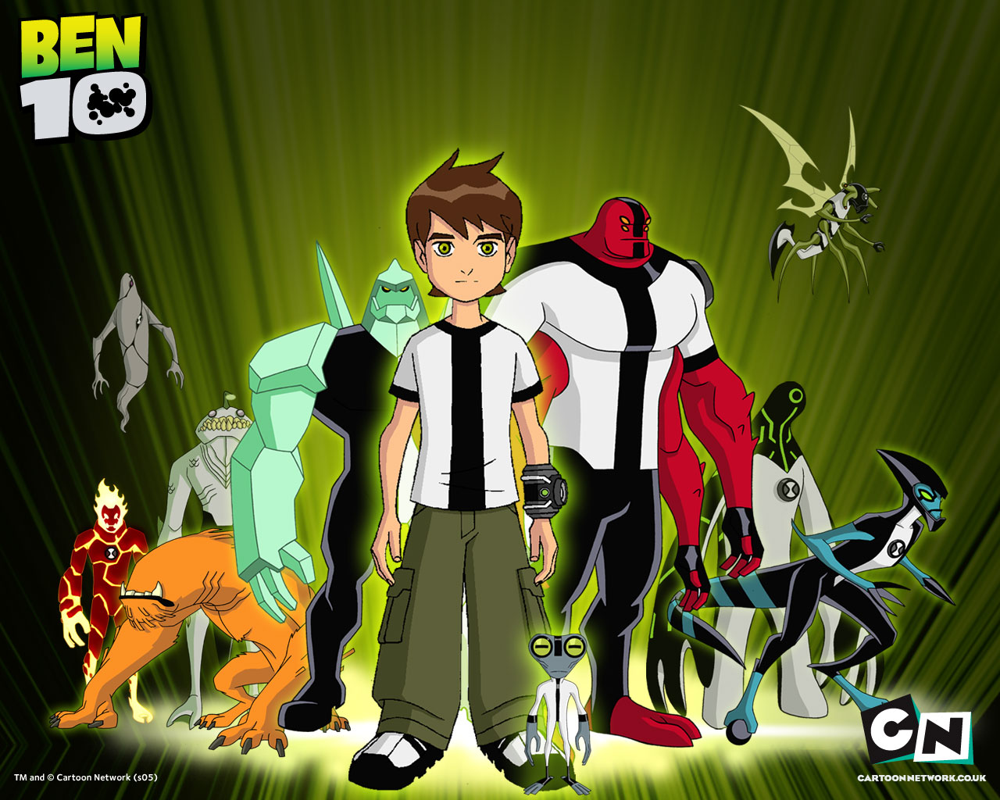

<!-- Dark Themed Profile README for @vaibhavjais2503 -->

  

  
  
  

---

## 🔗 Socials & Coding Profiles

  
  
  
  
  

---

## 🧰 Tech Stack 

  

---

## 📌 Project Cards 
<!--AUTO-PIN-CARDS:START-->

<!--AUTO-PIN-CARDS:END-->

---

## 📊 GitHub Analytics 

  
  

  

  

  

---

## 🗂️ All Public Repositories 
<!--AUTO-REPO-LIST:START-->
- [Health-prediction-of-fetus-using-ctg](https://github.com/vaibhavjais2503/Health-prediction-of-fetus-using-ctg) — A machine learning–based Streamlit app that predicts fetal health (Normal, Suspect, Pathological) from Cardiotocography data using multiple ML models.  • ★ 1 • updated 2025-09-17
- [ipl-cricket-predictor-new](https://github.com/vaibhavjais2503/ipl-cricket-predictor-new) — A Streamlit web app that predicts IPL match outcomes using machine learning on historical match and delivery data.  • ★ 1 • updated 2025-09-13
- [Plant_Disease_Detection](https://github.com/vaibhavjais2503/Plant_Disease_Detection) — _No description_  • ★ 1 • updated 2025-08-25
- [vaibhavjais2503](https://github.com/vaibhavjais2503/vaibhavjais2503) — HELLO EVERYONE  • ★ 0 • updated 2025-10-20
- [webhook-inbox](https://github.com/vaibhavjais2503/webhook-inbox) — A lightweight backend service to capture, inspect, and manage webhooks. Built with Node.js, Express, and SQLite.  • ★ 0 • updated 2025-09-01
- [SpamShield](https://github.com/vaibhavjais2503/SpamShield) — _No description_  • ★ 0 • updated 2025-04-13
- [IPL-Predictor](https://github.com/vaibhavjais2503/IPL-Predictor) — _No description_  • ★ 0 • updated 2025-04-13
- [demo](https://github.com/vaibhavjais2503/demo) — _No description_  • ★ 0 • updated 2023-01-29
<!--AUTO-REPO-LIST:END-->

---

## 🌈 Contribution Snake 

  

## 🎨 Fun Cartoon Section
<table>
  <tr>
    <td align="center">
      
    </td>
    <td align="center">
      
    </td>
  </tr>
</table>

---

## ✨ About
- 🔭 AI/ML • Robotics • Data-Science  
- ⚡ Love turning data into insights and building smart models
- 📨 Reach me: open an issue on any repo or DM on LinkedIn
